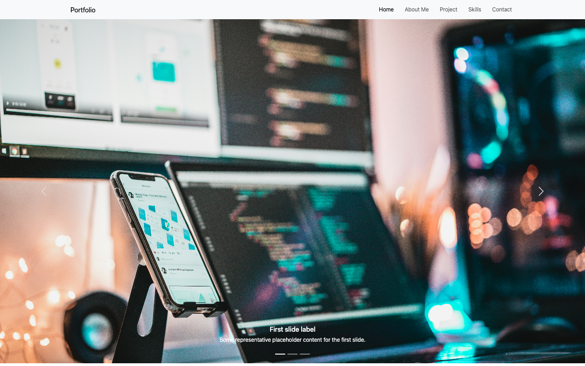
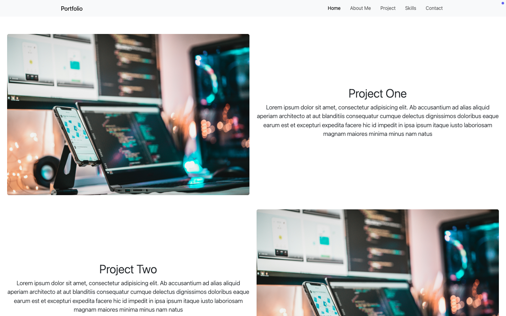
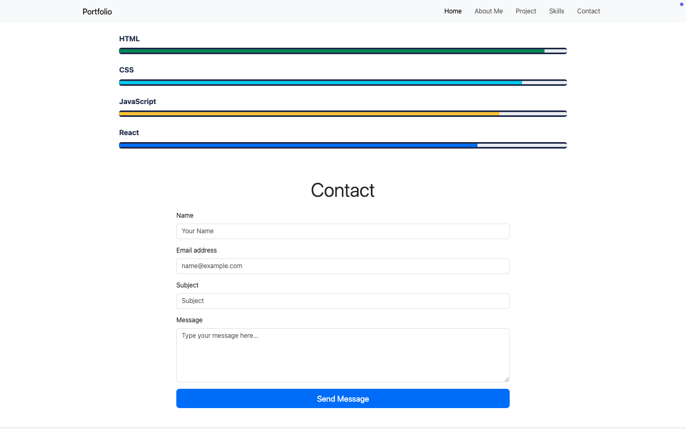

# Bootstrap Portfolio

A modern, responsive personal portfolio website built with HTML5, CSS3, and Bootstrap 5. This project showcases your skills, projects, and contact information in a clean, professional layout.

## Features

- **Responsive Design:** Looks great on all devices using Bootstrap 5.
- **Navigation Bar:** Sticky, collapsible navbar for easy navigation.
- **Image Carousel:** Hero section with a Bootstrap carousel for featured images.
- **About Section:** Includes a motivational quote and profile image.
- **Projects Section:** Highlights multiple projects with images and descriptions.
- **Skills Section:** Visual progress bars for key skills (HTML, CSS, JavaScript, React).
- **Contact Form:** Simple contact form for user inquiries.
- **Footer:** Social media links and copyright.

## Folder Structure

```
boostrap-portfolio/
├── index.html
├── style.css
├── css/                # Bootstrap CSS files
├── icons/              # Bootstrap Icons SVGs
├── img/                # Project images (not included here)
├── js/                 # Bootstrap JS files
└── viewImages/         # Screenshots of the website
    ├── homeSection.png
    ├── projectSection.png
    └── skillsAndContact.png
```

## Screenshots

Screenshots of the main sections are available in the `viewImages/` folder:
- `homeSection.png`: Home and carousel

- `projectSection.png`: Projects showcase

- `skillsAndContact.png`: Skills and contact form



## Getting Started

1. **Clone or Download** this repository.
2. **Open `index.html`** in your browser to view the site.
3. **Customize** the content, images, and styles as needed.

## Customization
- Replace images in the `img/` folder for your own projects and profile.
- Update the text in `index.html` for your own biography, projects, and contact info.
- Modify `style.css` for additional custom styles.

## Dependencies
- [Bootstrap 5](https://getbootstrap.com/) (CSS and JS)
- [Bootstrap Icons](https://icons.getbootstrap.com/)

All dependencies are included locally in the `css/`, `js/`, and `icons/` folders.


